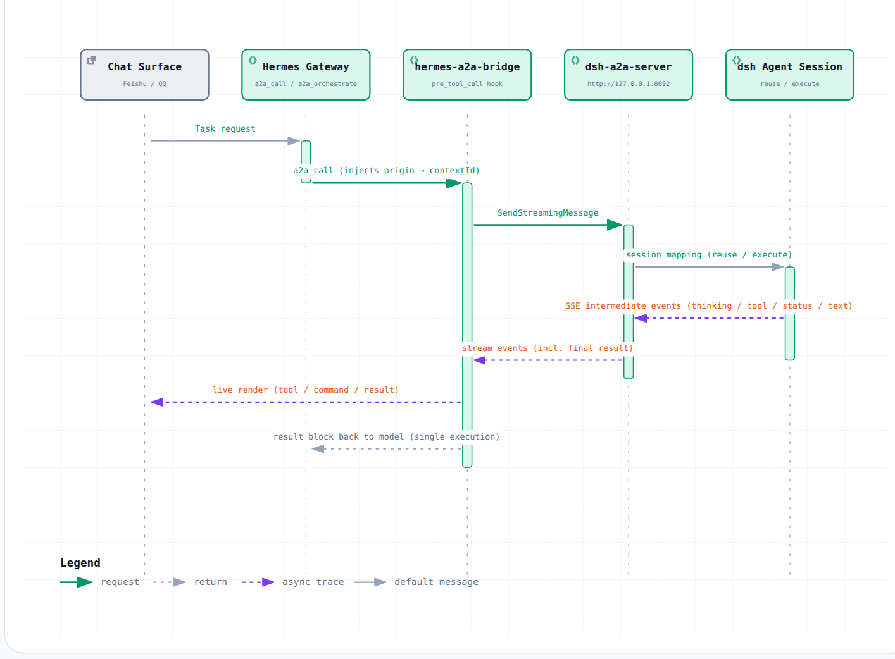

# hermes-a2a-bridge

**English** | [简体中文](README.md)

A bridge plugin on the Hermes side that connects to the dsh A2A server: it streams
dsh task execution live to Feishu / QQ and maps "one Hermes conversation ↔ one dsh
session" continuity onto `contextId`.

## Preview

### Live stream

When a dsh task is submitted, this plugin consumes the SSE stream and pushes
intermediate progress back to the messaging surface in real time. The live
sequence a user sees in Feishu / QQ looks like this (commands and results are
rendered as code blocks):

```
🚀 开始执行
🧠 思考中…
🔧 `bash`                    <- tool call, command in a code block
    ┌─ ```bash
    │  ls -la /tmp
    └─ ```
📋 `bash` 完成               <- tool result, output in a code block
    ┌─ ```
    │  total 4
    │  drwxrwxrwt  2 root root 40 Sep 11 14:00 .
    └─ ```
📖 输出完成                  <- long result rendered as a code block
✅ 完成
```

Long text exceeding the gateway's per-message limit is split at code-block
boundaries; continuation chunks are joined with a `⏩ 续` marker, so code blocks
never break across chunks.

> The sample above is the `detailed` tier — tool commands and results go into code
> blocks and thinking gets its own line (`🧠 思考中…`). By default `follow-dsh`
> follows dsh's current tier, and the dsh "Work
> details" value in production today is `standard`, so the live stream is **group
> push**: each turn closes into one closed-state line (e.g.
> `🔧 已读取文件并搜索代码` — "Read files and searched code"), `thinking` is **folded
> into the group, never pushed on its own**, with a heartbeat line
> `🔧 正在执行 · 第 N 步 · ...` every 6 steps, **no longer two lines per step**; to get
> the per-step look above, set `collector.live_detail: detailed` (or `verbose`) — a
> one-line rollback.

### Code blocks

Operation content — tool commands, execution results, and final text — is
automatically rendered as code blocks:

- **Feishu**: fenced content triggers post rich text; code blocks are scrollable;
- **QQ / other mainstream gateways**: markdown code blocks render as code blocks;
- **plain-text platforms**: automatically degraded to plain text (no garbling).

Sample code-block content (an `ls -la` output block):

```text
total 4
drwxrwxrwt  2 root root 40 Sep 11 14:00 .
drwxrwxrwt  2 root root 40 Sep 11 14:00 ..
-rw-r--r--  1 root root  0 Sep 11 14:00 demo.txt
```

> Actual rendering depends on each gateway's client.

Progress display and intermediate-event push are both configurable
(`collector.live_detail` for the **progress-display tier** — four tiers `compact` /
`standard` / `detailed` / `verbose`, mapping one-to-one onto dsh's "Work details",
default `follow-dsh` to follow dsh's current tier; `standard` is **group push** — one
closing line per turn (`thinking` folded into the group, never pushed on its own) plus a
heartbeat every 6 steps, while `detailed` / `verbose` send
per-step lines with code blocks; `collector.events` for the event stream — off is quiet
mode, pushing the final result only, and it **outranks the tier**; code-block rendering
stays as the internal style for a tier and is no longer a standalone switch), and can be
toggled or selected from the "A2A live switches" panel on the Dashboard "Plugins" page
(instant effect) — see [CONFIGURATION.en.md](CONFIGURATION.en.md).

## Architecture



## Relationship with dsh-a2a-server

This plugin and [dsh-a2a-server](https://github.com/ArtomYuan/dsh-a2a-server) are not
hard-bound; combine them as needed:

| Combination | What you get |
| --- | --- |
| dsh-a2a-server only | A standard A2A interface callable by any A2A client |
| This plugin only | Not applicable — it relies on dsh-a2a-server as its server |
| Both together | Full experience: task submission + live progress (🔧 / 📖 / ✅) + session continuity (one conversation ↔ one dsh session) + single execution |

## Installation

1. Clone the plugin into the plugins directory:

   ```sh
   mkdir -p ~/.hermes/plugins
   git clone https://github.com/ArtomYuan/hermes-a2a-bridge ~/.hermes/plugins/hermes-a2a-bridge
   ```

2. Enable the plugin in `~/.hermes/config.yaml`:

   ```yaml
   plugins:
     enabled:
       - hermes-a2a-bridge
   ```

3. Configure the dsh peer (pointing at dsh-a2a-server):

   ```yaml
   a2a_agents:
     dsh:
       url: http://127.0.0.1:8092
       auth:
         type: bearer
         token: <same token as the dsh-side A2A_SERVER_TOKEN>
   ```

4. Restart the Hermes gateway to take effect (how depends on your deployment):

   ```bash
   # Example: user-level systemd service
   systemctl --user restart hermes-gateway
   ```

## Live switches (Dashboard, instant effect)

Once the plugin is loaded, the three live-stream switches — `collector.enabled`
(master switch) / `collector.events` (intermediate events) / `collector.live_detail`
(live-detail tier; a dropdown with 5 options: follow dsh / terse / standard /
detailed / fully expanded) — can be toggled or selected directly from the "A2A
live switches" panel at the top of the Hermes
Dashboard "Plugins" page; saving takes effect **immediately (no gateway restart
— hot read)**. The backend endpoints
`GET/POST /api/plugins/hermes-a2a-bridge/collector` strictly validate and write
back `plugins.entries.hermes-a2a-bridge.settings.collector.*` (preserving the
entry-level `allow_tool_override` and all other keys; POST tolerates the legacy
`code_blocks` key as a deprecated alias of the legacy `content`). First deployment
needs one dashboard-process restart for the panel to appear.
See [CONFIGURATION.en.md](CONFIGURATION.en.md), "Live consumer".

## Links

- Detailed configuration and mechanics: [CONFIGURATION.en.md](CONFIGURATION.en.md)
- Changelog: [CHANGELOG.md](CHANGELOG.md)
- License: GPL-3.0 (see `LICENSE`) — this project is an independent, self-built
  plugin.
