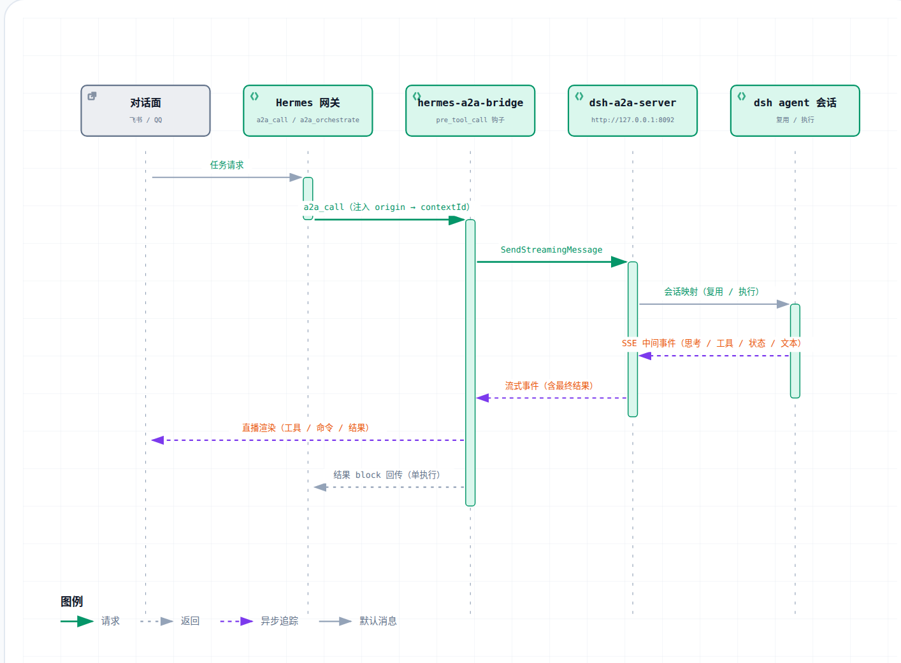

# hermes-a2a-bridge

[English](README.en.md) | **简体中文**

Hermes 侧接入 dsh A2A server 的桥插件：把 dsh 任务的执行过程实时直播到飞书 / QQ，
并把「一个 Hermes 对话 ↔ 一个 dsh 会话」的上下文连续性落到 `contextId` 上。

## 效果展示

### 直播流样式

投递一个 dsh 任务后，本插件边消费 SSE 流边把中间进度实时推回消息面，用户在
飞书 / QQ 里看到的完整直播序列大致如下（命令与结果以代码框呈现）：

```
🚀 开始执行
🧠 思考中…
🔧 `bash`                    ← 工具调用，命令进代码框
    ┌─ ```bash
    │  ls -la /tmp
    └─ ```
📋 `bash` 完成               ← 工具结果，输出进代码框
    ┌─ ```
    │  total 4
    │  drwxrwxrwt  2 root root 40 Sep 11 14:00 .
    └─ ```
📖 输出完成                  ← 长结果以代码框输出
✅ 完成
```

长文本超过网关单条上限时按代码块边界分块，块间以 `⏩ 续` 提示衔接，代码框不会
跨块断裂。

### 代码框效果

操作内容——工具命令、执行结果、最终文本——会自动以代码框渲染：

- **飞书**：含代码围栏的内容触发 post 富文本，代码框可滚动查看；
- **QQ / 其它主流网关**：markdown 代码块渲染为代码框；
- **纯文本平台**：自动降级为普通文本（不产生乱码）。

代码框内效果示意（`ls -la` 输出块）：

```text
total 4
drwxrwxrwt  2 root root 40 Sep 11 14:00 .
drwxrwxrwt  2 root root 40 Sep 11 14:00 ..
-rw-r--r--  1 root root  0 Sep 11 14:00 demo.txt
```

> 实际效果以各网关客户端渲染为准。

代码框渲染与中间事件推送均可通过配置调整（`collector.code_blocks` 控制代码框样式、`collector.events` 控制事件流开关，均默认开启）——详见
[CONFIGURATION.md](CONFIGURATION.md)。

## 流程图



## 与 dsh-a2a-server 的关系

本插件与 [dsh-a2a-server](https://github.com/ArtomYuan/dsh-a2a-server) 并非强绑定，可按需组合：

| 组合 | 能实现 |
| --- | --- |
| 只用 dsh-a2a-server | 暴露标准 A2A 接口，任意 A2A 客户端可直接调用 |
| 只用本插件 | 不适用——本插件依赖 dsh-a2a-server 作为服务端 |
| 两者一起用 | 完整体验：任务投递 + 过程直播（🔧 / 📖 / ✅）+ 会话连续性（一个对话一个 dsh 会话）+ 单执行 |

## 安装说明

1. 克隆插件到插件目录：

   ```sh
   mkdir -p ~/.hermes/plugins
   git clone https://github.com/ArtomYuan/hermes-a2a-bridge ~/.hermes/plugins/hermes-a2a-bridge
   ```

2. 在 `~/.hermes/config.yaml` 启用插件：

   ```yaml
   plugins:
     enabled:
       - hermes-a2a-bridge
   ```

3. 配好 dsh peer（指向 dsh-a2a-server）：

   ```yaml
   a2a_agents:
     dsh:
       url: http://127.0.0.1:8092
       auth:
         type: bearer
         token: <与 dsh 侧 A2A_SERVER_TOKEN 同一把>
   ```

4. 重启 Hermes 网关生效（方式取决于你的部署）：

   ```bash
   # 示例：systemd 用户级服务
   systemctl --user restart hermes-gateway
   ```

## 链接

- 详细配置与机制说明：[CONFIGURATION.md](CONFIGURATION.md)
- 变更记录：[CHANGELOG.md](CHANGELOG.md)
- 许可证：GPL-3.0（见 `LICENSE`）——本项目为独立自研插件。
