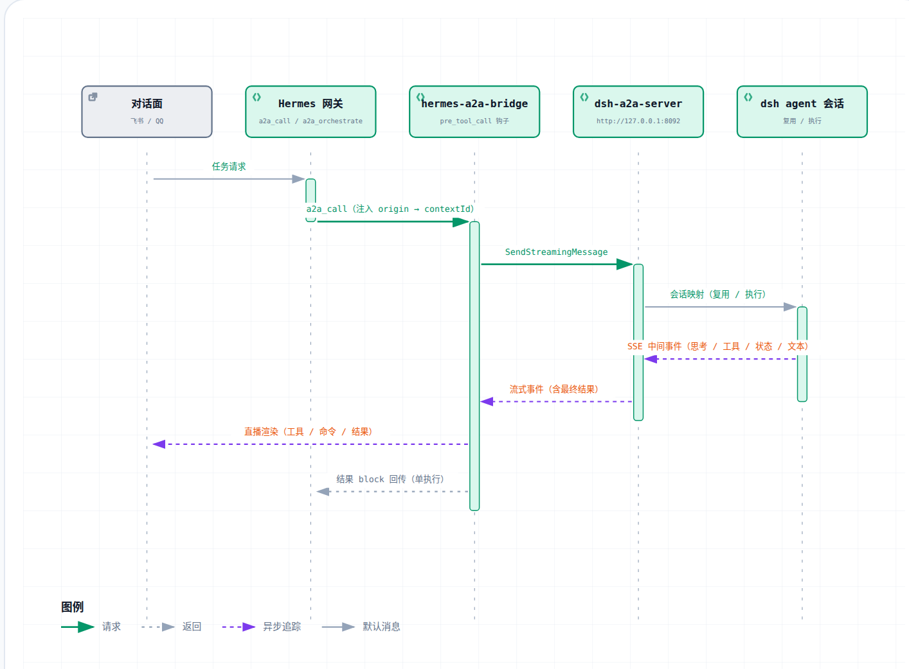

# hermes-a2a-bridge

[English](README.en.md) | **简体中文**

Hermes 侧接入 dsh A2A server 的桥插件：把 dsh 任务的执行过程实时直播到飞书 / QQ，
并把「一个 Hermes 对话 ↔ 一个 dsh 会话」的上下文连续性落到 `contextId` 上。

## 效果展示

### 直播流样式

投递一个 dsh 任务后，本插件边消费 SSE 流边把中间进度实时推回消息面。v0.7.0 起
**彻底改为纯文本行**：一轮内的工具步骤与思考渲染为一条 **dsh 行形态**的过程组
消息，逐行复刻 dsh 客户端「工作步骤展示」的行结构与图标（组头 `⌄` / 步骤行 `▸` /
思考行 `✦`）。用户在飞书 / QQ 里看到的完整直播序列大致如下（下例为 `standard` 档，
即当前生产 dsh 的默认档位；过程组与收束行各为一条消息）：

```text
⌄ 执行了命令，已读取文件，已搜索代码等
▸ 运行命令 · 查看提交
▸ 读取 · /tmp/a
▸ 搜索文件内容 · foo
▸ 运行命令 · echo 2
▸ 编辑 · /tmp/a
▸ 运行命令 · echo 3
▸ 写入 · /tmp/b
▸ 运行命令 · echo 4
✦ 思考 · 我先把目录结构列出来确认范围，再决定改哪几个文件。
```

```text
▸ 已完成，用时 12秒
```

上两段分别是 `consumer.render_process_group(members, "standard")` 与
`consumer.render_turn_close("completed", 12)` 的**实际输出**（非手写）。其中：

- **组头行** `⌄ <processTitle>`：`⌄` 是 dsh `IconChevronDown` 的文本等效；`processTitle`
  按工具类别的**出现次数降序**合成（1 类用完成文案、2 类 `A并B`、3 类 `，` 连接、
  >3 类取前 3 加 `等`、无工具时 `已完成分析`；思考不计入）。
- **步骤行** `▸ <工具标题> · <摘要>`：一行一步、无编号；标题取 dsh `tool.title.*`，
  摘要取 dsh `deriveSummary`（如 `description` 优先于 `command`）。
- **思考行** `✦ 思考 · <首行>`：`compact` 只出 `✦ 思考`，`verbose` 出全文。
- **收束行** `▸ 已完成`（或 `▸ 已完成，用时 <n>秒` / `▸ 处理失败` / `▸ 已停止`）：
  一轮一条，独立于过程组。`turn_start` 不再有 `🚀 第 N 轮` 行，`status` 终态也不再
  有 `✅ 完成` / `❌ 失败` / `⚠️ 已取消` 行——信息由收束行承载。

四档（`compact` / `standard` / `detailed` / `verbose`）都是这一个过程组，差异只在
**组内密度**：`compact` 仅组头 + `✦ 思考`（无步骤行、无预览）；`standard` 步骤行 +
思考首行预览；`detailed` 再加结果体（首行，缩进 2 空格）；`verbose` **不出组头**，
步骤行摘要不截断、思考与结果全文（续行缩进 2 空格）。
**既无工具步也无思考的轮次不发组**；只有思考、无工具时发一个只含思考行的组
（`compact` 为 `⌄ 已完成分析` + `✦ 思考`）。组头**不带轮次号**。

长文本超过网关单条上限时按**纯文本换行边界**分块，块间以 `⏩ 续` 提示衔接（纯文本分块，不存在跨块断裂问题）。

### 结果送达（普通 markdown，不截断）

任务结束时，本插件把最终结果以普通 markdown 主动送达消息面：
`📬 **dsh 任务完成，结果如下**（用时 …）` 头行 + 空行 + **结果原文**（不截断，自带
markdown 照常渲染；v0.7.0 起**一律为纯文本正文**）。超长（>8000）按换行边界分块，
块间 `⏩ 续`；无文本输出时只有头行。

```text
📬 **dsh 任务完成，结果如下**（用时 1 分 30 秒）

<结果原文>
```

### 显式 `context_id` 也会直播（v0.5.1）

`pre_tool_call` 的拦截条件为 `a2a_call` + `collector.enabled` + 目标为 dsh +
`message` 非空；直播 origin 取「调用方显式给出的 `context_id`」**优先**，否则取当前
消息面 origin。因此**显式携带 `context_id` 的调用同样会被拦截并直播**——v0.5.0 及
更早这类调用会被放行、直播完全不启动，这是 v0.5.1 修复的行为。

取舍：带显式 `context_id` 的调用由**同步**变为**异步**（秒回「⏳ 已受理」回执 →
后台执行 + 过程直播 → 完成后结果自动送达本对话）；调用方给出的 `context_id`
**原样采用、不被覆盖**，因此消息仍落在同一会话。

排查：若某会话没有直播消息，先确认该次 `a2a_call` 是否被拦截——被拦截时工具结果为
「⏳ 已受理」回执（日志形如 `Tool a2a_call returned error {"error":"[dsh · context …`）；
未被拦截时日志为 `tool a2a_call completed (…s, … chars)`。详见
[CONFIGURATION.md](CONFIGURATION.md)「排查：某会话为何没有直播消息？」。

### 直播档位与开关

过程展示与中间事件推送均可调整：`collector.live_detail` 控制**直播过程组的档位**
（四档 `compact` / `standard` / `detailed` / `verbose`，与 dsh「工作步骤展示」
一一对应；默认 `follow-dsh` 跟随 dsh 当前档位）；`collector.events` 控制事件流开关
（关 = 安静模式，只推最终结果，**优先于档位**）；dsh 行形态本身固定，不再单独暴露
开关。两者均可在 Dashboard「插件管理」
页的「A2A 直播开关」面板点选或下拉（即时生效）——详见
[CONFIGURATION.md](CONFIGURATION.md)。

## 流程图



## 与 dsh-a2a-server 的关系

本插件与 [dsh-a2a-server](https://github.com/ArtomYuan/dsh-a2a-server) 并非强绑定，可按需组合：

| 组合 | 能实现 |
| --- | --- |
| 只用 dsh-a2a-server | 暴露标准 A2A 接口，任意 A2A 客户端可直接调用 |
| 只用本插件 | 不适用——本插件依赖 dsh-a2a-server 作为服务端 |
| 两者一起用 | 完整体验：任务投递 + 过程直播（dsh 行形态过程组 + 收束行）+ 会话连续性（一个对话一个 dsh 会话）+ 单执行 |

## 安装说明

1. 克隆插件到插件目录：

   ```sh
   mkdir -p ~/.hermes/plugins
   git clone https://github.com/ArtomYuan/hermes-a2a-bridge ~/.hermes/plugins/hermes-a2a-bridge
   ```

2. 在 `~/.hermes/config.yaml` 启用插件：

   ```yaml
   plugins:
     enabled:
       - hermes-a2a-bridge
   ```

3. 配好 dsh peer（指向 dsh-a2a-server）：

   ```yaml
   a2a_agents:
     dsh:
       url: http://127.0.0.1:8092
       auth:
         type: bearer
         token: <与 dsh 侧 A2A_SERVER_TOKEN 同一把>
   ```

4. 重启 Hermes 网关生效（方式取决于你的部署）：

   ```bash
   # 示例：systemd 用户级服务
   systemctl --user restart hermes-gateway
   ```

## 直播开关（Dashboard 即时生效）

插件加载后，直播的三个开关——`collector.enabled`（总开关）/ `collector.events`
（中间事件推送）/ `collector.live_detail`（直播档位，下拉 5 选项：跟随 dsh / 简洁 /
标准 / 详细 / 完全展开）——可在 Hermes
Dashboard「插件管理」页顶部的「A2A 直播开关」面板直接
点选或下拉，保存**即时生效（无需重启网关，热读）**。后端端点
`GET/POST /api/plugins/hermes-a2a-bridge/collector` 严格校验后写回
`plugins.entries.hermes-a2a-bridge.settings.collector.*`（保留条目顶层
`allow_tool_override` 与其它所有键；POST 容忍旧键 `code_blocks` 作为遗留
`content` 的 deprecated 别名）。首次部署面板需重启一次 dashboard 进程。
详见 [CONFIGURATION.md](CONFIGURATION.md)「直播消费者」。

## 链接

- 详细配置与机制说明：[CONFIGURATION.md](CONFIGURATION.md)
- 变更记录：[CHANGELOG.md](CHANGELOG.md)
- 许可证：GPL-3.0（见 `LICENSE`）——本项目为独立自研插件。
